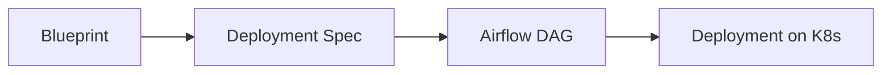

# StackGen Factory

Summary :

`StackGen Factory` is a intent based workflow to **Shift Left** the Whole deployment of the application development life cycle.

## Key Concepts

### WISB

- **Blueprint** Template authored by a User with a Role of Platform Administrator for a Team.

- **Deployment Spec** Deployment Spec is derived out of a **Blueprint**. Deplyment Spec is authored either by a Human or Agent or a Bot from default values inherited from Blueprint.

### Airflow

- Airflow is the chosen workflow engine.
- Deployment Sepc when authored is parsed and converted as Airflow `Workflow / Dag`
- Every Action is a sequence of steps in the workflow per Deployment spec

### Workflow



## Examples

### Blueprint

- [x] For team `Payments` a Platform Administrator or User with Equivalent role Creates a new BluePrint.

```YAML
name: hello
owner_team: platform
visibility: shared
questions:
  - id: app_name
    type: string
  - id: slo_error_rate
    type: number
    default: 0.01
  - id: port
    type: number
    default: 3000
  - id: health_path
    type: string
    default: /health
  - id: metrics_path
    type: string
    default: /metrics
boundaries:
  allowed_actions:
    - scaffold
    - build
    - deploy
    - promote
  environments:
    - staging
    - production
workload:
  replicas:
    default: 1
    production: 2
    max: 4
  cpu:
    default:
      requests: 50m
      limits: 200m
    production:
      requests: 200m
      limits: 1000m
  memory:
    default:
      requests: 64Mi
      limits: 128Mi
    production:
      requests: 256Mi
      limits: 512Mi
    values:
      - 128Mi
      - 256Mi
      - 512Mi
sequence:
  - id: scaffold
    action: scaffold
    environment: staging
  - id: build
    action: build
    environment: staging
    needs:
      - scaffold
  - id: deploy_staging
    action: deploy
    environment: staging
    needs:
      - build
  - id: sign_off
    gate: promotion_approval
    approver_role: release-manager
    needs:
      - deploy_staging
  - id: promote_production
    action: promote
    environment: production
    needs:
      - sign_off
record:
  - image
  - approver
  - error_rate_at_promotion
acceptance:
  - id: error_rate
    source: metrics
    expression: error_rate < {{ slo_error_rate }}
    window: 15s
version: 1.0.0

```

In the above example a new blueprint `hello` is created with defaults , and some questions to be filled by the person using this blueprint.

### Deployment Spec

- [x] For team `Payments` user / developer with a right role like developer uses the blueprint Hello.

- Provides the defaults like
  * Application name
  * Metrics port
  * Health check
  * Etc

- [x] User chooses the deployment environment , Defaulted to `K8`

- Submission generates a Airflow `Workflow / Dag`
  * Generates the workflow details
  * Converts the deployment spec to equivalent Workflow tasks and submits to Airfow.

### Airflow
  - On submission every workflow is a DAG
  - Every deployment spec is a DAG on its own
  - Every task executes on the completion of the previous task
  - Airflow provisions the following

    * Scaffolding the repository (with a default setup)
    * Builds the image, the image uses the semantic of `blueprint/appname:`. This provides the lineage of the usage of blueprint.
    * After successfuly deploys the workload to selected deployment machinery.
      * In this example it is k8s.

### Identity

  - Uses a simple Idenity Server a OIDC server for the control plane and the bot.
  - Bot is a dedicated account like a service account
  - Bot account is per Team

### Policy

  - Using a Policy engine evaluation for boundaries and approval mechanism.
  - User with the right permission can act on the task
  - Currently Approval of promotion is with a Policy
  - User Approves the Promotion and Airflow looks at the state of the policy to Promote.

## Components


| Name | Description | File Path |
| --- | --- | --- |
| **`controlplane`** | Api Layer orchestrating the whole UX | [control-plane](./control-plane) |  
| **`identity Server`** | Naive and mock Identity Server | [identity](./identity) |  
| **`orchestrator`** | Airflow setup | [orchestrator](./orchestrator) |  
| **`ui`** | Show and tell web | [ui](./ui) |  
| **`mcp`** | Simple MCP Server, Communicating with the `Control Plane` API | [mcp](./mcp) |  
|___|___|___|
| **`blueprints`** | Collection of blueprints created a repository / folder to manage.| [blueprints](./blueprints) |  
| **`deployments`** | Collection of deployments created from the blueprint.| [deployments](./deployments) |  

## What is not covered well
- Current Tasks on the workflow is linear.
- Alerts for the error rate the budget , it is envisioned as alerts only.
- Assumed the Agent / Human interaction as Bot vs User interaction only

## Design choices and Why

- Airflow: Workflow orchestrator, opensource and extensible
- K8S: Deployment machinery along with `Kustomize`
## Conclusion

- In theory this eco-system can work really well with a example like below.

  - A Git issue or a jira task is created to start a work
  - The work can take parameter as a blueprint
  - Commit Action / Webhooks can manage the deployment spec & submit to the orchestrator machinery.
