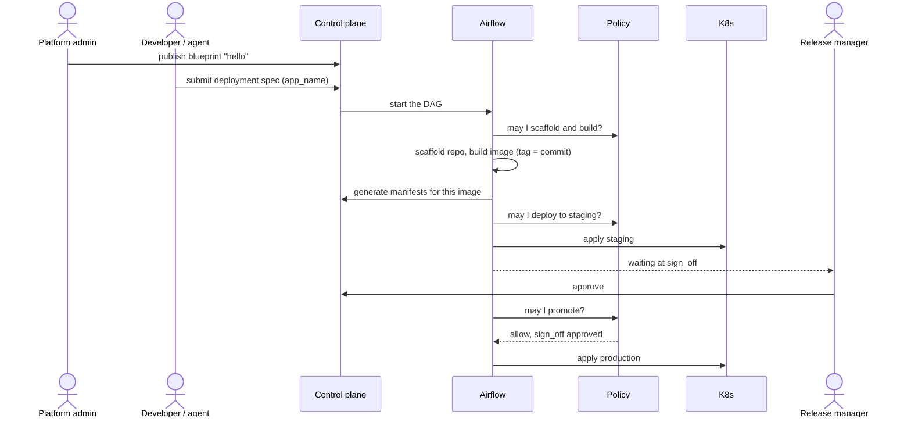

# StackGen Factory

A developer ships an application to production without filing a ticket, while the platform team still decides what is allowed, in what order, and who has to approve.

## The story of one deployment

**1. The platform team writes the rules once.**
A platform admin publishes a **blueprint**, `hello`: which steps may run, in which environments, with what resources, and that production needs a release manager's sign-off.

**2. A developer asks for a deployment.**
A developer, or an agent acting for one, picks `hello` and answers its few questions, such as the app name. That produces a **deployment spec**: the blueprint plus the answers, frozen. Writing it is what starts the run.

**3. Airflow does the work, step by step.**
The spec becomes an Airflow **DAG**. It scaffolds a repository, builds an image tagged with the commit, and only then generates the k8s manifests naming that image. It deploys to staging.

**4. Every step asks permission first.**
Before each action, the worker asks the policy engine. The worker decides nothing; the blueprint and the recorded approvals do.

**5. A person approves production.**
The run waits at `sign_off`. A release manager approves; a bot cannot. Only then is the same image promoted to production.



## The four things

| | What it is | Who makes it |
|---|---|---|
| **Blueprint** | the rules for an operation; one blueprint, many deployments | platform admin |
| **Deployment spec** | one deployment: blueprint + answers, immutable | developer or agent |
| **DAG** | the run in Airflow; steps can fork and join | generated from the spec |
| **Deployment** | the app running in k8s, one namespace per team and environment | the DAG |

## Why it is built this way

- **Two documents.** The blueprint is the template; the spec is what was actually deployed, kept for the audit.
- **Policy at every action.** A run sent straight to promote is refused: no approval is on record. Answers are `allow`, `deny` or `cannot_tell`, and every one is recorded.
- **Manifests after build.** A failed build leaves nothing behind naming an image that does not exist.
- **Airflow.** Open source and extensible. A run waiting days for approval holds no worker.
- **k8s + kustomize.** k8s is the first target, not the only one. kustomize gives one overlay per environment.

## Try it

```
make up      # cluster, identity, policy, airflow, control plane
make down
```

Then publish a blueprint and submit a spec from the UI, or through the MCP server from an agent.

## Not done yet

- The manifests call from Airflow to the control plane is not authenticated.
- Only `scaffold`, `build`, `deploy` and `promote` have task handlers.
- Acceptance (error rate) becomes alerts; it does not yet stop a run.

More detail: [details.md](./details.md)
___
## Screen Captured

The screen captured videos are organized in the order .

| Seq | Description | File Path |
| --- | --- | --- |
| **1**   | Creating a new blueprint for a Team `payments`|[Creating a new Blueprint](https://www.loom.com/share/0314b21623de4fddaf3af8f147ad1795)
| **2**   | Creating a new Deployment spec from the blueprint created  for a Team `payments`|[Creating a new Deployment spec](https://www.loom.com/share/45567d097973429e97dcad6c4584447e)
| **2.1**   | Creating a new Deployment spec with Workloads provisioned; from the blueprint created  for a Team `payments`|[Creating a new Deployment Spec workload](https://www.loom.com/share/96579451ebf14bebb48f0e500e34f338)
| **3**   | Approve for Promotion of the workload|[Approve for Promotion](https://www.loom.com/share/40847a657ee0481f9e21d2b97b007c32)
| **3.1** | Provisioning workloads on production Approve for Promotion of the workload|[Provisioning workloads](https://www.loom.com/share/cf0e5333e3aa413692098fa9a92fe980)
| **4** | Multi Stage Work flow with Airflow|[Multi Stage Work flow with Airflow](https://www.loom.com/share/ac49d6f876ce4575b336a23da752c03b)
